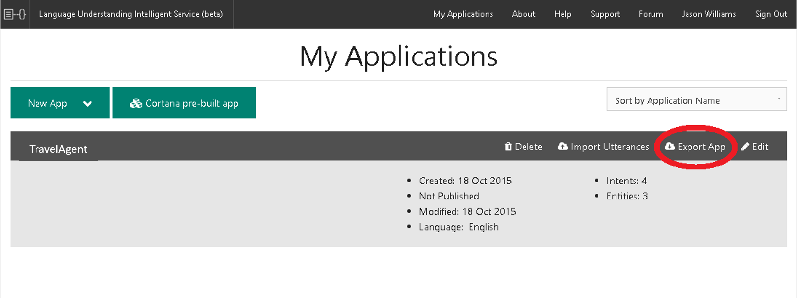
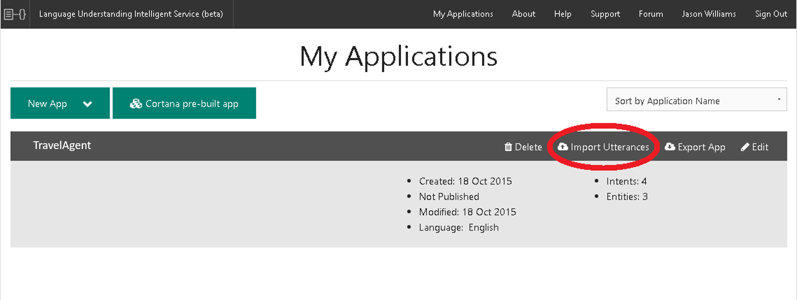

<!-- 
NavPath: LUIS API
LinkLabel: Importing and Exporting 
Url: LUIS-api/documentation/ImportingAndExporting
Weight: 76 
-->

#Importing Utterances

If you have example utterances in your domain, you can load them into LUIS using the "Import Utterances" feature. Utterances should be stored in a text file, with one utterance per line. On the "My Applications" page, click on the "Import Utterances" button for the LUIS application that you want to import utterances into. This is shown in the example below: 

In the dialog box, click on "Browse", select the text file containing the utterances you want to import, and click on "OK". The dialog box will show how many utterances have been queued to be imported, and how many were discarded, for example because they are empty lines or duplicates. 

After importing, utterances will be available in the "Search" and "Suggest" tabs. If a large set of utterances is uploaded, it may take several minutes for all to be available. 

Note that the "Import" function is for unlabeled data. If you have labeled utterances you want to load into LUIS, see the next section on importing and exporting an application.

###Importing and Exporting Applications

######Exporting an application

LUIS lets you export all of the labels and features you've entered for an application. To do this, click on the "Export App" icon in the list of applications. This is shown in the example below: 

This will download a JSON object that contains all of the information you've entered. Note that it does not contain unlabeled utterances; these can be downloaded by clicking on Edit -> Publish -> Download Logs. 

######Importing an application

This JSON file can now be uploaded to create a new application using New App -> Import Existing App. This dialog box contains an optional application name. This is useful if you already have an application with the same name as the exported application. 

######Using import to upload labeled utterances

The JSON file can be edited outside of LUIS before being re-imported, for example to add labeled utterances. For entity labels, note that the start and end positions refer to tokens, not characters. Tokenization depends on the culture (locale) of the application -- see the section on Localization for more information. 

######Copying/sharing applications

The JSON file for an exported application contains all of the "source" required to re-create the application. Thus exported application can be re-imported to perform copy an application. In addition, a JSON file can be shared with other LUIS developers. 

######Version control and team support

The JSON file for an exported application is human-readable. This makes the JSON file suitable for managing in version control, outside of LUIS -- the human-readability makes it possible to perform manual merges where necessary. 

A typical development process therefore is to create a LUIS model, publish it to an HTTP endpoint, export the source JSON, and check the JSON into version control alongside the application that calls the LUIS endpoint. As data arrives on the endpoint, model improvements can be made in LUIS, and periodically the application can be re-exported and merged into the repository. To add new application functionality that requires a change in LUIS behavior -- for example, adding a new intent -- a branch can be created, and the existing LUIS application can be imported into a new LUIS application. Changes can be made in this new LUIS application, then published to a second HTTP endpoint. The new LUIS application can be exported and checked back into the repository. In other words, different versions of the client application can refer to different LUIS applications, so that the LUIS schema and the application are in sync. 

###Notes about importing and exporting applications

Note that when an application is exported, this includes the cleartext of all labeled utterances. If these labeled utterances contain personally identifying information, then the terms of service of LUIS or your application may restrict or prohibit sharing the application source. 

Also, when a JSON file is imported, it does not have access to the unlabeled utterances associated with application from which the JSON file was exported. If you want to copy the unlabeled utterances from one application to another, first download the unlabeled utterances from the source application with Edit -> Publish -> Download Logs, then upload them to the target application with Import Utterances. 
